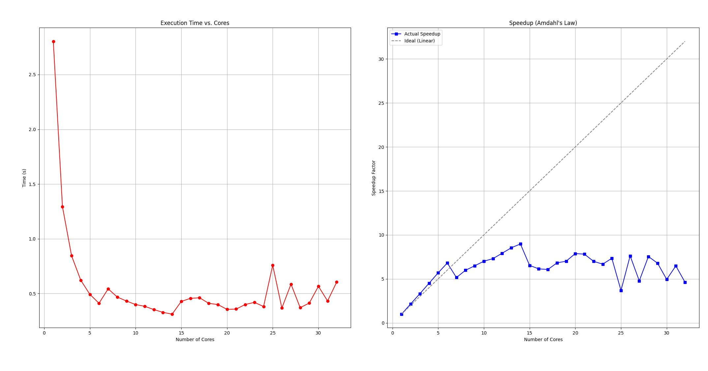

# Rapport : Bucket Sort

L'objectif de ce rapport est de parcourir les demarches de l'eleve, et d'y analyser les choix et les resultats qu'il a pu obtenir.

## 1 - Bucket Sort Algorithm

Le bucket sort contient peu d'etapes:

| Étape | Description                             | Commande / Méthode |
| :---- | :-------------------------------------- | :----------------- |
| 1     | Trouver les quantiles de son bucket     | `np.quantile()`    |
| 2     | Partager les quantiles avec les autres  | `comm.Alltoall()`  |
| 3     | Calculer les macro-quantiles globaux    | `np.quantile()`    |
| 4     | Découper son bucket selon ces limites   | `cut()` method     |
| 5     | Partager les découpes (données réelles) | `comm.Alltoallv()` |
| 6     | Trier les données reçues localement     | `np.sort()`        |

## 2 - Optimisation

En effet, tout l'interet de ce tp est de leverage le multiprocessing pour executer un programme plus vite. Cela n'a aucun sens de comparer de la python-speed (avec multiprocessing) et la C-speed de `numpy`.

Il a ete important de prune toutes les parties du code qui faisaient des calculs en utilisant les directives python, pour les remplacer avec celles de `numpy` (C-Python). Ainsi, il est possible de comparer `np.sort()` avec mon `bucket sort`, car nous ne comparons plus "apples and oranges".

Il s'en suit que les directives de partage de `mpi4py` devaient necessairement etre en version majuscules qui manipulent simplement des pointeurs et des tableaux, plutot que devoiir interpreter en live les message pour size correctement les recieve_buffer selon le type.

Il est a noter que la documentation de `numpy` a ete utilisee exhaustivement, mais plusieurs tricks dont le array masking de `self.cut()` dans `bucket_optimized.py` et les directives specifiques de `insert` et `cumsum` pour calculer les displacements ont ete proposes **par une IA**. Ceci semble raisonable car il est difficile de trouver dans la doc quelquechose auquel on ne s'y attend pas. Celles-ci on depuis ete integre dans mon arsenal, mais ce paragraphe d'honnetete intellectuelle me semblait necessaire.

    Python devient ainsi un wrapper pour du code lourdement oriente par la philosophie des languages compiles, et profite donc de leur vitesse.

## 3 - Choix de la Machine

Mon ordinateur ne contient que deux cores, et les machines de l'ensta ne nous donnent pas acces a une multitude d'informations que je voulais, commencant par la topologie de celle-ci.

```
henry.royer@info1-new:~$ apt install sudo
E: Impossible d'ouvrir le fichier verrou /var/lib/dpkg/lock-frontend - open (13: Permission non accordée)
E: Impossible d'obtenir le verrou de dpkg (/var/lib/dpkg/lock-frontend). Avez-vous les droits du superutilisateur ?
henry.royer@info1-new:~$ sudo apt install lstopo
-bash: sudo : commande introuvable
```

Ecrire un rapport sans ces informations cle est inutile, j'ai donc emprunte l'ordinateur d'un ami. L'utilisateur "Paul-Edouard" qui a ete ajoute en tant que contribuant dans le git est donc moi-meme sur son ordinateur.

La topologie de sa machine est comme suit:

[topologie de la machine de paul-edouard](./topology.pdf)

_voir question 1 sur ce resultat de lstopo_

## 4 - Resultats

### Obtention

Pour obtenir les resultats, un court programme bash a ete redige, afin de faire tourner la commande mpiexec -n $p bucket_optimized.py pour plusieurs valeurs de p, pour pouvoir calculer le speedup et voir l'evolution en fonction du nombre de processeurs.

_voir question 2 sur les manieres d'obtenir des resultats de speedup_

Pour simuler l'existence de cores supplementaires, j'ai utilise l'option `--oversubscribe` de `mpiexec`, c'est pourquoi le graphique s'etend jusqu'a 32 cores, alors que j'en ai seulement 16.

### Visualisation

Pour visualiser les resultats, le programme `scaling_graphs.py` a ete utilise. **Je ne l'ai pas redige moi-meme**. La barre horizontale en tirets est la vitesse de np.sort()



### Analyse

#### Scaling..

Le speedup obtenu est une courbe tres interressante a analyser. En effet, sur les $6$ premieres processeurs, on voit une droite qui match exactement ce a quoi on s'attent, la courbe classique de speedup. Mais a partir du 6eme, il y a une chute, a la fois en speedup, et en pente, ceci est du a la topologie de la machine.

Grace a `affinity = os.sched_getaffinity(0)` on peut associer `rank` dans `MPI` avec les numeros des cpu de `lstopo`. ceci revele que `MPI` demande pour $n$ processeurs d'utiliser les $n$ premiers, et non pas un subset de ceux qui sont libres, ou autre.

Or les 6 premiers sont proche donc il est sensiblement gratuit de comuniquer entre eux. lorsqu'on ajoute le 7eme proc, il faut attendre ses envois de messages, il est donc nuisible au groupe : il aurait ete plus rapide de se passer de sa puissance de calul marginale supplementaire car on y perd plus a l'attendre que le travail qu'il fournit.

Ceci n'est plus vrai a partir du 11eme PU: on retrouve le meme speedup que 6 cores. C'est le point d'inflexion a partir duquel les ressources supplementaires compensent l'attente des directives de communication. Jusqu'au 14e, ce c'est plus que du gain.

Comme indique dans la _question 1_, j'ai beaucoup de mal a interpreter ce qui se passe pour les 15e et 16e PU, je ne comprends pas quelle est leur relation aux autres.

Au dela de 17, on tombe dans le domaine de `oversubscribe` qui simule l'existence d'autres PU, en fait, ce n'est plus utile d'ajouter des cores s'ils n'existent pas physiquement, meme si les $6$ premiers cores sont hyperthreade. La variance devient tres haute, et ce domaine n'est pas ou l'on trouvera la performance.

#### ..Par rapport a un core

Le but final de ce projet est de comprendre que le multiprocessing est un vrai avantage par rapport a la programmation sequentielle sur un core. Heureusement, c'est exactement ce que l'on trouve, un peu d'ingenuite, et beaucoup de technologie est un peu plus rapide qu'un algorithme decrit il y a plus de 80 ans. (`np.sort()` utilise un tri en $O(n*ln(n))$).

Je ne sais pas combien de ceci est du au choix du langage, ou au manque d'acces a une machine bien plus performante avec plusieurs dizaines de cores. Il est meme possible d'envisager de faire ces calculs sur une carte graphique, mais ceci sera peutetre explore dans la suite du cours...

## 5 - Questions

### question 1

Je n'ai pas reussi a changer le formatting de lstopo donc les cores etaient disstribues sur deux lignes. Cependant, les cores 14 et 15 partagent-ils le meme L2 que 10-13 ?, Possedent-ils meme un L3, ou un acces a la ram identique aux autres? ces notions ne m'ont pas ete claires.

### question 2

Pour obtenir les resultats, j'ai redige un programme `scaling.sh` naif qui boucle sur le nombre de processeurs et execute le programme, tout en mettant les resultats dans un `results.csv`. Y-a-t-il des directives MPI (que je n'ai pas trouve) qui permettent ceci de facon automatique ?

## Annexe

### Faire tourner le code

Afin de faire tourner ce code sur votre machine, il faudra au prealable installer les librairies python, normalement toutes decrites dans BYOD.md a la source de ce fork.
La seule que j'ai ajoutee est `os` qui m'a permi de faire des analyses plus en detail sur les resultats
